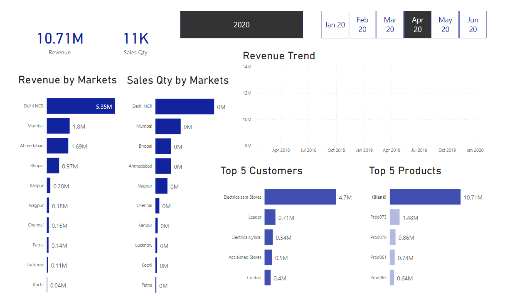

# AtliQ-Hardware-Sales-Insights

A Power BI dashboard to understand AtliQ hardware goods sales trend!

## Dataset:

The `db_dump.sql` file above is the SQL database dump for our project. After importing it to our server `DEV_sales_insights`, we go through the data to understand its structure and anamolies. Further analysis and visualizations are performed on Microsoft Power BI.

